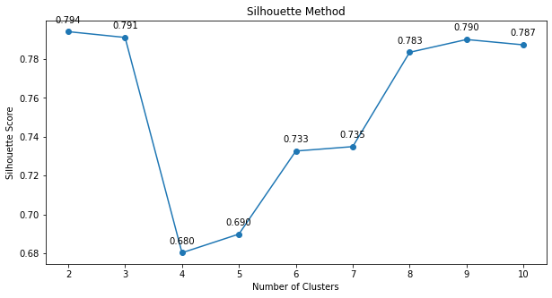

# PENGELOMPOKAN DATA PEMINJAMAN BUKU DI PERPUSTAKAAN SMA 5 MUHAMMADIYAH DENGAN MENGGUNAKAN METODE K-MEANS CLUSTERING

## LATAR BELAKANG MASALAH

Perpustakaan berperan penting sebagai pusat informasi dan edukasi yang mendukung literasi, penelitian, dan pembelajaran bagi berbagai kalangan. Namun, di SMA 5 Muhammadiyah, minat siswa dalam meminjam buku menurun drastis setelah pandemi COVID-19, meskipun berbagai upaya seperti peningkatan jumlah buku telah dilakukan. Penurunan ini diperburuk oleh kebiasaan belajar daring yang membuat siswa kurang tertarik membaca buku secara fisik. Pihak perpustakaan menghadapi tantangan dalam memahami pola peminjaman buku akibat kurangnya pengetahuan dalam pengolahan dan analisis data peminjaman.

Untuk mengatasi masalah ini, metode data mining dapat digunakan untuk menganalisis data peminjaman buku dan mengidentifikasi pola yang mendasarinya. Berdasarkan karakteristik data dan keterbatasan pengetahuan teknis pihak perpustakaan, metode K-Means Clustering dipilih karena kesederhanaannya, kemudahan implementasi, dan efisiensinya dalam memproses data berukuran besar. Penelitian ini akan menggunakan K-Means Clustering untuk mengelompokkan data peminjaman buku menjadi tiga cluster: diminati, cukup diminati, dan kurang diminati, sehingga pihak perpustakaan dapat lebih efektif dalam mengelola koleksi dan meningkatkan minat baca siswa.

## POKOK PERMASALAHAN

1. Penurunan signifikan dalam jumlah peminjaman buku terjadi di SMA 5 Muhammadiyah pasca pandemi COVID-19, menimbulkan kebutuhan akan pengadaan buku dengan langkah yang strategis.
2. Kurangnya pengetahuan dan keterampilan dalam pengolahan data di perpustakaan SMA 5 Muhammadiyah menghambat identifikasi dan respons terhadap pola peminjaman buku.

## GOALS

Berdasarkan pokok permasalahan yang Anda paparkan, tujuan atau goals dari penelitian ini dapat dirumuskan sebagai berikut:

1. **Menganalisis Pola Peminjaman Buku di Perpustakaan SMA 5 Muhammadiyah**  
   Penelitian ini bertujuan untuk mengidentifikasi pola peminjaman buku yang terjadi selama periode tertentu, khususnya setelah penurunan signifikan pasca pandemi COVID-19. Dengan menganalisis data ini, perpustakaan dapat memahami preferensi siswa terhadap buku yang diminati.

2. **Menggunakan Metode K-Means Clustering untuk Mengelompokkan Buku Berdasarkan Frekuensi Peminjaman**  
   Tujuannya adalah untuk membagi buku menjadi beberapa kategori (diminati, cukup diminati, dan kurang diminati) berdasarkan pola peminjaman, sehingga perpustakaan dapat lebih mudah menyusun strategi pengadaan buku di masa mendatang.

3. **Memberikan Rekomendasi Pengadaan Buku yang Lebih Strategis dan Efektif**  
   Berdasarkan hasil clustering, penelitian ini bertujuan untuk memberikan solusi strategis kepada perpustakaan dalam mengelola koleksi buku, dengan fokus pada buku yang paling diminati oleh siswa.
   
Tujuan tersebut sesuai dengan pendekatan yang diambil dalam penelitian terdahulu, seperti yang dilakukan oleh Januardi Nasir (2021) dan Baker (2020), yang menggunakan algoritma K-Means Clustering untuk membantu perpustakaan dalam memahami pola peminjaman buku dan melakukan pengelolaan koleksi yang lebih efektif.

## ANALISIS TAHAPAN PENDEKATAN

Pendekatan yang digunakan dalam penelitian ini adalah menerapkan metode **K-Means Clustering** untuk mengelompokkan buku di perpustakaan SMA 5 Muhammadiyah berdasarkan pola peminjaman. Algoritma K-Means Clustering digunakan untuk mengidentifikasi kelompok buku yang diminati, cukup diminati, dan kurang diminati.

Beberapa langkah yang akan dilakukan:

1. **Data Understanding**: Menganalisis dataset peminjaman buku dari tahun 2018-2023 untuk memahami pola peminjaman, termasuk variabel-variabel penting seperti judul buku, tanggal peminjaman, kategori buku, dan frekuensi peminjaman.

2. **Data Cleaning & Feature Engineering**: Membersihkan dataset dari nilai yang hilang atau duplikat, serta mempersiapkan data untuk keperluan clustering. Langkah ini termasuk normalisasi data untuk memastikan fitur-fitur dalam dataset memiliki skala yang sebanding.

3. **Modeling**: Menggunakan algoritma **K-Means Clustering** untuk mengelompokkan buku menjadi tiga cluster berdasarkan frekuensi peminjaman. Evaluasi hasil cluster dilakukan untuk memastikan pemisahan buku dalam kategori diminati, cukup diminati, dan kurang diminati berjalan efektif.

4. **Evaluation**: Menggunakan metrik evaluasi seperti **Silhouette Score**, **Davies-Bouldin Index**, dan **Calinski-Harabasz Index** untuk menilai kualitas cluster yang terbentuk. Hasil evaluasi ini akan digunakan untuk memastikan bahwa cluster yang terbentuk optimal dan sesuai dengan tujuan penelitian.

Dengan pendekatan ini, perpustakaan dapat mengidentifikasi pola peminjaman buku dengan lebih baik, sehingga bisa digunakan untuk mengoptimalkan pengadaan buku sesuai dengan preferensi siswa dan meningkatkan minat baca di perpustakaan.

## ALGORITMA 

## Algoritma yang Digunakan

### 1. K-Means Clustering

**K-Means Clustering** adalah salah satu algoritma pengelompokan data yang digunakan untuk membagi data ke dalam sejumlah cluster (kelompok) berdasarkan kemiripan antara data tersebut. Algoritma ini bekerja dengan menentukan sejumlah **K** cluster berdasarkan jarak antara titik data dengan pusat cluster (centroid).

#### Langkah-langkah K-Means:
1. Tentukan jumlah cluster, K.
2. Pilih secara acak K titik sebagai centroid awal.
3. Hitung jarak antara setiap titik data ke centroid, lalu kelompokkan data berdasarkan centroid terdekat.
4. Perbarui posisi centroid dengan menghitung rata-rata dari semua titik data dalam cluster.
5. Ulangi langkah 3 dan 4 hingga centroid tidak lagi berubah atau jumlah iterasi maksimum tercapai.

#### Rumus:
Jarak antara titik data \(x_i\) dan centroid \(c_k\) dihitung menggunakan jarak Euclidean:

$$
d(x_i, c_k) = \sqrt{\sum_{j=1}^{n} (x_{ij} - c_{kj})^2}
$$

Total sum of squares within cluster (WCSS) digunakan sebagai metrik evaluasi, yaitu penjumlahan dari kuadrat jarak setiap titik data dengan centroid cluster-nya:

$$
WCSS = \sum_{k=1}^{K} \sum_{x_i \in C_k} d(x_i, c_k)^2
$$

**Kelebihan**:
- Mudah dipahami dan diimplementasikan.
- Efisien untuk dataset berukuran besar.

**Kekurangan**:
- Sensitif terhadap pemilihan jumlah cluster \(K\).
- Tidak efektif untuk data dengan bentuk cluster yang tidak bulat atau data yang memiliki ukuran cluster berbeda.

### 2. Silhouette Score

Silhouette Score adalah salah satu metrik evaluasi yang digunakan untuk menilai kualitas cluster. Skor ini mengukur seberapa mirip titik data dengan cluster-nya sendiri dibandingkan dengan cluster lainnya. Nilai Silhouette berkisar antara -1 hingga 1, di mana skor mendekati 1 menunjukkan bahwa data berada di cluster yang benar, sedangkan skor mendekati -1 menunjukkan data lebih dekat ke cluster lain.

#### Rumus:
Silhouette Score untuk data \(i\) dihitung dengan rumus:

$$
S(i) = \frac{b(i) - a(i)}{\max(a(i), b(i))}
$$

Di mana:
- \(a(i)\) adalah jarak rata-rata antara data \(i\) dengan semua data di cluster yang sama.
- \(b(i)\) adalah jarak rata-rata antara data \(i\) dengan semua data di cluster terdekat.

### 3. Davies-Bouldin Index

Davies-Bouldin Index adalah metrik evaluasi lain yang digunakan untuk menilai kualitas clustering. Semakin rendah nilai Davies-Bouldin, semakin baik kualitas cluster yang terbentuk. Indeks ini mengukur rasio antara jarak rata-rata dalam cluster dan jarak antar centroid cluster.

#### Rumus:
Davies-Bouldin Index dihitung dengan rumus:

$$
DB = \frac{1}{K} \sum_{i=1}^{K} \max_{i \neq j} \left( \frac{\sigma_i + \sigma_j}{d(c_i, c_j)} \right)
$$

Di mana:
- \(K\) adalah jumlah cluster.
- \(\sigma_i\) adalah jarak rata-rata antara titik data di cluster \(i\) dengan centroid \(c_i\).
- \(d(c_i, c_j)\) adalah jarak antara centroid \(c_i\) dan \(c_j\).

### 4. Calinski-Harabasz Index

Calinski-Harabasz Index adalah metrik evaluasi yang mengukur rasio antara dispersi antar cluster dan dispersi dalam cluster. Semakin tinggi nilai indeks ini, semakin baik hasil clustering.

#### Rumus:
Calinski-Harabasz Index dihitung dengan rumus:

$$
CH = \frac{(n - K)}{(K - 1)} \cdot \frac{B_K}{W_K}
$$

Di mana:
- \(n\) adalah jumlah data.
- \(K\) adalah jumlah cluster.
- \(B_K\) adalah scatter antar cluster.
- \(W_K\) adalah scatter dalam cluster.

### Kesimpulan:
Algoritma dan metrik evaluasi ini digunakan untuk memastikan kualitas cluster yang terbentuk dalam penelitian ini. K-Means Clustering dipilih karena kesederhanaan dan efisiensinya, sementara metrik evaluasi seperti Silhouette Score, Davies-Bouldin Index, dan Calinski-Harabasz Index digunakan untuk menilai seberapa baik cluster yang terbentuk dalam analisis pola peminjaman buku.

## PENELITIAN DAN HASIL

### 1. Data Understanding
Pada tahap ini, dilakukan pemahaman mendalam terhadap dataset yang digunakan, yaitu data peminjaman buku dari perpustakaan SMA 5 Muhammadiyah dari tahun 2018 hingga 2023. Data ini berisi informasi penting seperti:
- **Nama Peminjam**: Identitas siswa yang meminjam buku.
- **Jenis Kelamin**: Untuk melihat apakah ada pola tertentu dalam peminjaman berdasarkan gender.
- **Kelas**: Informasi tentang tingkat kelas siswa, yang dapat memengaruhi preferensi dalam peminjaman buku.
- **Judul Buku**: Jenis buku yang dipinjam oleh siswa, penting untuk melihat kategori buku yang populer.
- **Tanggal Pinjam dan Pengembalian**: Informasi ini digunakan untuk melihat kapan puncak peminjaman terjadi dan mengukur durasi peminjaman.

Dataset ini membantu dalam mengidentifikasi buku mana yang sering dipinjam, waktu puncak peminjaman, dan perbedaan preferensi berdasarkan gender dan kelas siswa. Dataset ini adalah langkah awal untuk membangun model clustering dan akan diolah lebih lanjut untuk menemukan pola yang signifikan.

Berikut adalah file **data.csv** yang berisi data mentah yang akan dianalisis:

- [Lihat Data Mentah](./Data/data.csv)

### 2. Data Cleaning dan Preparation
Setelah data dianalisis, langkah berikutnya adalah melakukan pembersihan data (data cleaning) untuk mengatasi masalah seperti:
- **Missing Values**: Data yang hilang atau tidak lengkap, seperti nama buku atau tanggal peminjaman yang kosong, harus dihapus atau diperbaiki.
- **Duplikasi Data**: Mengidentifikasi dan menghapus peminjaman yang tercatat lebih dari satu kali untuk buku yang sama dalam waktu yang berdekatan.
- **Normalisasi Data**: Data harus dinormalisasi untuk memastikan semua fitur memiliki skala yang sama. Ini penting terutama untuk atribut yang berbeda skala, seperti tanggal atau frekuensi peminjaman.
- **Feature Engineering**: Atribut-atribut kategori seperti judul buku dan kelas diubah menjadi numerik untuk digunakan dalam model clustering. Selain itu, dilakukan perhitungan frekuensi peminjaman setiap buku per tahun untuk melihat tren yang berkembang.

Pada tahap ini, data diubah menjadi bentuk yang siap digunakan untuk analisis lebih lanjut. Transformasi ini mempersiapkan data untuk proses clustering sehingga hasil analisis lebih akurat.

Berikut adalah hasil dari proses pembersihan dan transformasi yang disimpan dalam file **Hasil Transformasi.xlsx**:

- [Download Hasil Transformasi](./Data%20Hasil/Hasil%20Transformasi.xlsx)

### 3. Hasil Clustering
Setelah data dibersihkan dan dipersiapkan, metode **K-Means Clustering** diterapkan untuk membagi buku ke dalam 3 cluster, yaitu:
- **Cluster 1 (Buku Paling Diminati)**: Cluster ini terdiri dari buku-buku yang sering dipinjam oleh siswa. Sebagian besar buku dalam cluster ini adalah buku dengan genre yang lebih populer seperti religi, yang memiliki daya tarik tinggi di kalangan siswa.
- **Cluster 2 (Buku Cukup Diminati)**: Cluster ini mencakup buku-buku yang cukup sering dipinjam tetapi tidak sepopuler buku-buku dalam Cluster 1. Buku dengan genre seperti drama atau romance sering masuk dalam cluster ini.
- **Cluster 3 (Buku Kurang Diminati)**: Buku-buku dalam cluster ini jarang dipinjam oleh siswa. Biasanya buku-buku dengan genre yang lebih umum, atau mungkin materi yang sudah usang dan tidak lagi relevan dengan kebutuhan siswa.

Algoritma K-Means bekerja dengan menghitung jarak antara setiap titik data (buku) dengan centroid dari cluster dan mengelompokkan buku berdasarkan jarak terdekat. Cluster ini dihasilkan berdasarkan frekuensi peminjaman buku, dan memberikan gambaran buku mana yang harus diprioritaskan untuk pengelolaan perpustakaan.

Berikut adalah file hasil clustering:

- [Download Hasil Clustering](./Data%20Hasil/penentuan_cluster.xlsx)

### 4. Evaluasi Cluster
Setelah hasil clustering diperoleh, langkah selanjutnya adalah mengevaluasi kualitas cluster yang terbentuk. Beberapa metrik evaluasi yang digunakan meliputi:

#### 4.1. **Silhouette Score**
Silhouette Score digunakan untuk menilai seberapa baik setiap titik data berada di dalam cluster-nya sendiri dibandingkan dengan cluster terdekat. Skor Silhouette berkisar antara -1 hingga 1. Nilai yang mendekati 1 menunjukkan bahwa data tersebut berada di cluster yang benar, sedangkan nilai negatif menunjukkan bahwa data tersebut lebih cocok berada di cluster lain.
- **Hasil**: Berdasarkan evaluasi Silhouette Score, sebagian besar data berada di cluster yang sesuai dengan skor mendekati 0,8, yang menunjukkan hasil clustering yang cukup baik.

Berikut adalah visualisasi dari **Silhouette Score**:
- 

#### 4.2. **Davies-Bouldin Score (DBS)**
Davies-Bouldin Score digunakan untuk mengukur jarak antar cluster. Semakin rendah nilai DBS, semakin baik kualitas cluster yang terbentuk. Nilai DBS dihitung berdasarkan rasio jarak antar centroid cluster dengan jarak rata-rata dalam cluster.
- **Hasil**: Nilai DBS yang dihasilkan dalam clustering ini cukup rendah, yang menunjukkan bahwa jarak antar cluster cukup signifikan dan cluster yang terbentuk memiliki kualitas yang baik.

#### 4.3. **Calinski-Harabasz Score (CHS)**
Calinski-Harabasz Score mengevaluasi kekompakan dan pemisahan antar cluster. Semakin tinggi nilai CHS, semakin baik hasil clustering.
- **Hasil**: Skor CHS yang tinggi menunjukkan bahwa cluster yang terbentuk memiliki pemisahan yang jelas dan data di dalam cluster cukup kompak.

Berikut adalah visualisasi dari **DBS dan CHS**:
- 

### 5. Rekomendasi dan Implementasi
Berdasarkan hasil clustering dan evaluasi, beberapa rekomendasi yang dapat diimplementasikan untuk perpustakaan SMA 5 Muhammadiyah adalah:
1. **Penambahan Koleksi Buku untuk Cluster 1**: Buku-buku yang termasuk dalam **Cluster 1** sebaiknya diprioritaskan untuk penambahan koleksi. Karena buku-buku ini paling sering dipinjam, perpustakaan dapat meningkatkan stok buku tersebut atau menambahkan buku serupa untuk memenuhi permintaan siswa.
2. **Penghapusan atau Penggantian Buku di Cluster 3**: Buku dalam **Cluster 3**, yang kurang diminati, bisa dipertimbangkan untuk digantikan dengan buku-buku baru yang lebih relevan dengan kebutuhan siswa. Buku-buku lama yang sudah tidak populer dapat dipindahkan atau diarsipkan.
3. **Promosi Buku di Cluster 2**: Buku-buku dalam **Cluster 2**, yang cukup diminati, bisa dipromosikan lebih aktif di kalangan siswa. Ini dapat dilakukan melalui kampanye literasi, rekomendasi dari guru, atau promosi di perpustakaan untuk meningkatkan minat siswa terhadap buku-buku tersebut.

Rekomendasi ini bertujuan untuk meningkatkan efektivitas pengelolaan perpustakaan, memastikan ketersediaan buku yang paling diminati, dan meningkatkan minat baca siswa dengan memanfaatkan hasil clustering dari data peminjaman buku.

